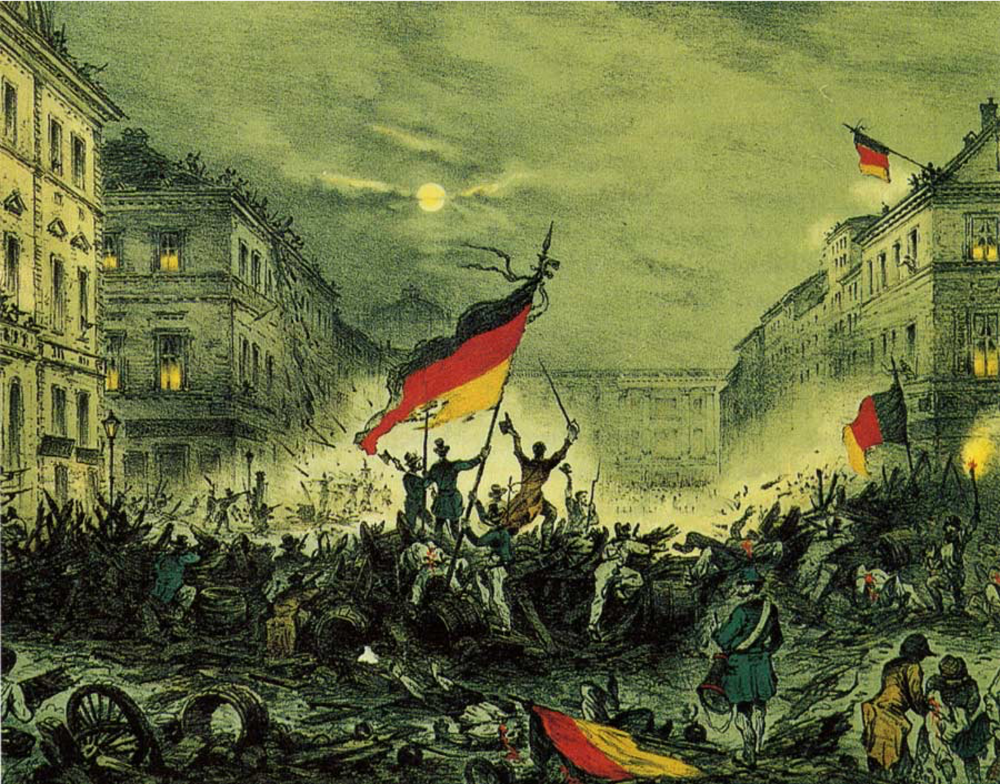

# Grundlos wird sich nichts verändern

Industrie 4.0 und Digitalisierung. Buzzer-Words der aktuellen Zeit verkünden eine Industrierevolution, deren Sinn und Grundgedanken nicht immer ganz offensichtlich sind. 

Erstaunlich genug, dass führende Institute in Studien tiefgreifend untersuchen, ob es sich tatsächlich um eine Revolution oder vielmehr nur um eine Industrie-Evolution handelt. Sind wir doch allerorts in unserer modernen Industrie des 21. Jahrhunderts bereits längst digital ausgestattet und gut vernetzt. Und selbst dieser Text, geschrieben auf einen portablen Rechner angedockt an eine Cloud zum öffentlichen Verbreiten dieses Gedankengutes. Etwas Feintuning, einige Notepad in der Fertigung, höhenverstellbare Tische und ein guter Scanner zur Produktverfolgung. Fertig ist Industrie 4.0. Wer es glaubt kennt das eigentliche Motiv hinter der Digitalisierung und hinter Industrie 4.0 offensichtlich noch nicht. [Prof. Dr. Frank Piller](https://de.wikipedia.org/wiki/Frank_Piller) der RWTH Aachen sagt:

> Die Digitalisierung wird schneller Gewinner produzieren, als die Verlierer wissen, dass sie Verlierer sind.

Also sei allen Bewahrern Vorsicht geboten, die sich allzu gern auf den Lorbeeren der deutschen Industriegeschichte ausruhen möchten. Oder mit den Worten von [Peter Kruse](https://de.wikipedia.org/wiki/Peter_Kruse): ["Und bist Du nicht willig, dann brauch ich Geduld."](https://www.youtube.com/watch?v=e_94-CH6h-o)

## Digitalisierung und Industrie 4.0

Wer sich mit der Fragestellung Digitalisierung oder Industrie 4.0 (gerne auch Wirtschaft oder Gesellschaft 4.0) beschäftigt, der muss sich etwas aus der Mitte der digitalen Technik entfernen. Es gilt: "Never change a running system". Und so stellt sich die Frage, warum so radikale Veränderungen, wie Revolution namens Industrie 4.0, im Gange sein sollen. Den Grund dafür liefert bereits 2010 [Yoram Koren](https://en.wikipedia.org/wiki/Yoram_Koren) vom MIT in seinem Buch [The global manufacturing revolution](https://erc.engin.umich.edu/wp-content/uploads/sites/50/2013/08/12pgbook.pdf). 

Letztendlich sind es  vermarktbarer Nutzen und Kundenbedürfnisse, die alle Kräfte einer Wirtschaft und Industrie hervorbringt. Wer Bedürfnisse erfüllt, für die andere bereit sind, Geld zu zahlen, macht ein Geschäft. Wer das Bedürfnisse Vieler gleichzeitig erfüllen kann, macht das ganz große Geschäft. So entstand vor mehr als 150 Jahren das Industriezeitalter, den Wirtschaftlern als Taylorismus bekannt. Die Wertschöpfung verändert sich von der handwerklichen Manufaktur hin zur Massenproduktion. Henry Ford wollte jeden in die Lage versetzen, ein Automobil zu fahren. Hauptsache es war schwarz und hieß Ford T.

Seit dieser Zeit hat sich unsere Industrie, Ihre Prozesse und Methoden ständig verbessert. Am Gipfel der Massenproduktion kamen jedoch durch Wohlstand und Marktsättigung mehr und mehr die individuellen Bedürfnisse der Menschen durch. Seither befinden wir uns im Zeitalter des Masscustomzing. Industrialisiert und zu Preisen der Massenproduktion erwarten wir Konsumenten nicht irgend ein Produkt, sondern genau das Produkt unserer Vorstellungen. Natürlich sofort oder spätestens morgen.

Wer "echte" digitale Produkte anbieten will, weiß es längst. DIGITALISIERUNG ist die totale Individualisierung für Jeden. Egal wann, egal wo, egal wieviel, egal wie ausgefallen.

Schon die großen Studien von Gartner, IBM, Forbes & Co. ergaben unlängst: Der Weg zur digitalen Transformation führt über Automatisierung und Individualisierung. Aus Sicht konventioneller analoger Industrialisierung, was für ein Gegensatz.

Die bislang erfolgreichen Automatisierungslösungen inklusive ihrer recht statischen Steuerungsarchitekturen sind einer ausufernden totalen Individualität einfach nicht mehr gewachsen. Sie stammen noch aus der Zeit der Massenproduktion. Ihre zentralen Steuereinheiten sind unflexibel und kaum in der Lage sich rasen schnell anzupassen. Kurz um, sie sind am Ende. Und das ist wirklich Grund genug, für ein Revolution. Die Kämpfer auf den Barrikaden sind keine Krieger, es sind Softwareentwickler und innovative Neudenker. Ihre Waffen sind ihre Rechner, die Munition ist Code. Sie sind die digitale Generation.

## Eine Architektur als Baustein einer neuen dezentralen unabhängigen Steuerungswelt

Diese MicroCell Architektur ist ein möglicher Baustein. Sie ist dezentral und wandelbar. Unabhängig und unvoreingenommen. Generisch und sehr abstrakt. Sie ist ein Bauanleitung für einen digitalen Organismus, ein System, welches wächst durch Code vieler Entwickler.

### [zurück](README.md)

------

Dieses Werk **OurPlant MicroCell Architektur** von [Häcker Automation GmbH](https://www.haecker-automation.de/) ist lizenziert unter einer <a rel="license" href="http://creativecommons.org/licenses/by-sa/4.0/">Creative Commons Namensnennung - Weitergabe unter gleichen Bedingungen 4.0 International Lizenz</a>

Die Quellen dieser Arbeiten finden sich auf [Github](https://github.com/GerritHaecker/MicroCell-Architektur)