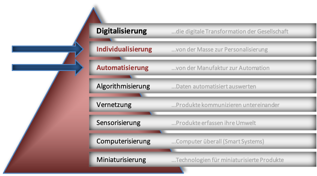
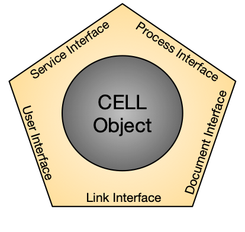

# Die MicroCell Architektur
Dezentrale Steuerungsarchitektur der OurPlant Maschinenplattform

## Einführung

Wozu braucht es eine neue, eine andere Steuerungsarchitektur? Wohl stellt sich die Frage in Hinblick auf die Unmengen an Lösungen der Steuerungstechnik und der Softwarestrukturen. Und dennoch scheint es unter den Gesichtspunkten einer neuen Zeit Schranken in unserem Denken zu geben, die uns einen einfache evolutionäre Weiterentwicklung der bestehenden Basis verhindert.

Industrie 4.0 und Digitalisierung. Buzzer-Words der aktuellen Zeit verkünden sie eine Industrierevolution, deren Sinn und Grundgedanken nicht immer ganz offensichtlich sind. 

Erstaunlich genug, dass führende Institute in Studien tiefgreifend untersuchen, ob es gar nur eine Industrie-Evolution sei und weniger einer Revolution. Sind wir doch allerorts in unserer modernen Industrie des 21. Jahrhunderts doh bereits schon längst digital ausgestattet. Und selbst dieser Text, geschrieben auf einen portablen Rechner angedockt an eine Cloud zum öffentlichen Verbreiten dieses Gedankengutes. Etwas Feintuning, einige Notepad in der Fertigung, Höhenverstellbare Tische und ein guter Scanner zur Produktverfolgung. Fertig ist Industrie 4.0. Wer es glaubt kennt das eigentliche Motiv hinter der Digitalisierung und hinter Industrie 4.0 offensichtlich noch nicht. 

### Digitalisierung und Industrie 4.0

Wer sich mit der Fragestellung Digitalisierung oder Industrie 4.0 (gerne auch Wirtschaft oder Gesellschaft 4.0) der muss sich etwas aus der Mitte der Technik entfernen. Auch hier gilt: Never change a running system. Und so stellt im Gegenzuzug die Frage, warum so radikale Veränderungen, wie Revolution names Industrie 4.0, im Gange sein sollen. Den Grund dafür liefert bereits 2010 Yoram Koren vom MIT in seiner Arbeit über "The global manufacuring revolution". 

Letztendlich sind es die Bedürfnisse oder auch der vermakrtbare Nutzen, der alle Kräfte einer Wirtschaft und Industrie treibt. Wer Bedürfnisse erfüllt, für die andere bereit sind, Geld zu zahlen, macht ein Geschäft. Wer das Bedürfnisse Vieler gleichzeitig erfüllen kann, macht das ganz große Geschäft. So entstand vor mehr als 150 Jahren das Industriezeitalter als Taylorismus. Die Wertschätzung verändert sich von der handwerklichen Manufaktur hin zur Massenproduktion. Henry Ford wollte jeden in die Lage versetzen, ein Automobil zu fahren. Hauptsache es war schwarz, kam aus einem seiner Fließbandwerke und hieß Ford T.

Seit dieser Zeit hat sich unsere Industrie, Ihre Prozesse und Methoden ständig verbessert. Am Gipfel der Massenproduktion kamen jedoch durch Wohlstand und Marktsättigung mehr und mehr die individuellen Bedürfnisse der Menschen durch. Seither befinden wir uns im Zeitalter des Mass-customzing. Industrialisiert und zur Preisen der Massenproduktion erwarten die Konsumenten nicht irgend ein Produkt, sondern genau das Produkt ihrer Vorstellungen.

Wer "echte" digitale Produkte anbieten will, weiß es längst. DIGITALISIERUNG ist die totale Individualisierung für Jeden. Egal wann, egal wo, egal wieviel, egal wie ausgefallen.

Schon die großen Analysen von Gartner, IBM, Forbes & Co. Ergaben unlängst: Der Weg zur digitalen Transformation führt über  Automatisierung und Individualisierung. 

Die bislang erfolgreichen Automatisierungslösungen inklusive ihrer recht statischen Steuerungsarchitekturen sind einer ausufernden totalen Individualität jedoch nicht gewachsen. Sie stammen noch aus der Zeit der Massenproduktion. Ihre zentralen Steuereinheiten sind unflexibel und kaum in der Lage sich rasen schnell anzupassen. Kurz um, sie sind am Ende. Und das ist wirklich Grund genug, für ein Revolution. Die Kämpfer auf den Barrikaden sind keine Krieger, es sind Softwareentwickler und innovative Neudenker. Ihre Waffen sind ihre Rechner, die Munition ist Code. Sie sind die digitale Generation.

### Eine Architektur als Baustein einer neuen dezentralen unabhängigen Steuerungswelt

Diese MicroCell Architektur ist ein möglicher Baustein. Sie ist dezentral und wandelbar. Unabhängig und unvoreingenommen. Generisch und sehr abstrakt. Sie ist ein Bauanleitung für einen digitalen Organismus, ein System, welches wächst durch Code vieler Entwickler.

### Ziel dieser Architektur Entwicklung

+ Wandlungsfähiges und flexibles Steuerungssystem
+ Dezentral, Anbieter unabhängig, verteilte Ressourcen
+ Modular und modifizierbar, skalierbar
+ Entwickler unabhängig
+ Offen dezentral entwickelt und dennoch hohe Stabilität und Qualität

Die MicroCell Architektur ist eine offene, unabhängige dezentrale Systemarchtiktur. Sie wurde entwickelt, um unbegrenzt und unabhängig Entwickler für eine gemeinsame Lösung zu vereinen. 

### Lizenz

Dieses Werk ist lizenziert unter einer [Creative Commons Namensnennung - Weitergabe unter gleichen Bedingungen (BY-SA) 4.0 International Lizenz](http://creativecommons.org/licenses/by-sa/4.0/deed.de).

This work is licensed under a <a rel="license" href="http://creativecommons.org/licenses/by/4.0/">Creative Commons Attribution 4.0 International License</a>.

