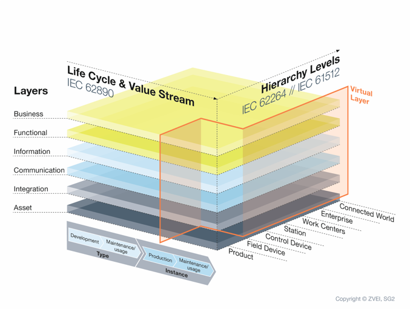
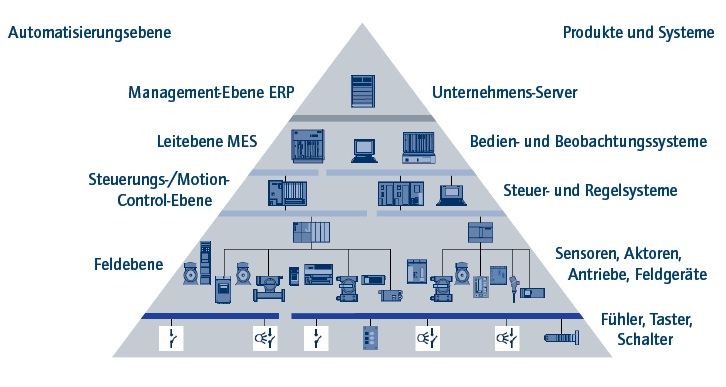
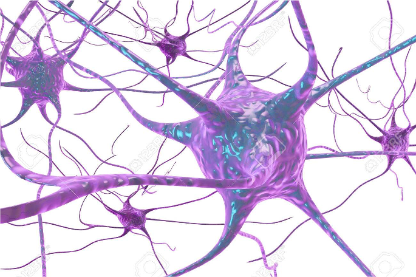

# Die MicroCell Architektur
## Vorwort

Wozu braucht es eine neue, eine andere Steuerungsarchitektur? Wohl stellt sich die Frage in Hinblick auf die Unmengen an Lösungen der Steuerungstechnik und der Softwarestrukturen. Und dennoch scheint es unter den Gesichtspunkten einer neuen Zeit Schranken in unserem Denken zu geben, die uns einen einfache evolutionäre Weiterentwicklung der bestehenden Basis verwehren.

"Never change a running system." Gilt sicher auch für die Entwicklung von neuen Systemen und Architekturen. Und so dürfen wir sicher davon ausgehen: Grundlos wird nichts verändert. 

Das Entwicklerteam der Häcker Automation kennt seit Jahren die Grenze der bestehenden Entwicklungsansätze. Die Hardware ist längst auf die neuen Anforderungen eingestellt. Auch das war kein ganz einfacher Weg. Modularität, Wandlungsfähigkeit und dezentrale mechatronische Systeme sind keinesfalls gängige Lösungsansätze des Maschinenbaues des späten zwanzigsten Jahrhunderts. Und dennoch ist es nach fast 25 Jahren gelungen, einen höchst modularen und austauschbaren Baukasten an unabhängigen Subsystemen aufzubauen. Der Softwareentwicklung war dieser gewaltige Schritt noch nicht gelungen. Ein organisch gewachsener Kern einer durchaus modular einstellbaren Gesamtlösung kommt immer häufiger an seine Grenzen. Überlagerte Funktionaltäten behindern und verfehlen sich mitunter. Eine Prüfbarkeit von scheinbar unendlich vielen Kombinationsmöglichkeiten der Hardwaremodule scheint chancenlos. 

Wer da glaubt, man könne die Anwendungsfälle vorhersehen und überprüfen, der weiß noch nicht, was wandlungsfähig wirklich bedeutet. Maschinen der OurPant-Plattform, die heute gebaut werden, werden nach zehn Jahren noch im Einsatz sein und Produkte produzieren, von denen wir heute noch gar nichts ahnen. In unserer schnelllebigen Technologiewelt werden sie dann Aufgaben erfüllen, von denen wir jetzt noch nicht wissen.  

## Architektur Entwicklung 4.0

1. [Grundlos wird nicht's verändert](Grundlos wird nichts verändert.md)
2. [Auf dem Weg zur neuen Architektur](Auf dem Weg zur neuen Architektur.md)

------

# Grundlos wird sich nichts verändern
Industrie 4.0 und Digitalisierung. Buzzer-Words der aktuellen Zeit verkünden eine Industrierevolution, deren Sinn und Grundgedanken nicht immer ganz offensichtlich sind. 


Erstaunlich genug, dass führende Institute in Studien tiefgreifend untersuchen, ob es sich tatsächlich um eine Revolution oder vielmehr nur um eine Industrie-Evolution handelt. Sind wir doch allerorts in unserer modernen Industrie des 21. Jahrhunderts bereits längst digital ausgestattet und gut vernetzt. Und selbst dieser Text, geschrieben auf einen portablen Rechner angedockt an eine Cloud zum öffentlichen Verbreiten dieses Gedankengutes. Etwas Feintuning, einige Notepad in der Fertigung, höhenverstellbare Tische und ein guter Scanner zur Produktverfolgung. Fertig ist Industrie 4.0. Wer es glaubt kennt das eigentliche Motiv hinter der Digitalisierung und hinter Industrie 4.0 offensichtlich noch nicht. [Prof. Dr. Frank Piller](https://de.wikipedia.org/wiki/Frank_Piller) der RWTH Aachen sagt:

> Die Digitalisierung wird schneller Gewinner produzieren, als die Verlierer wissen, dass sie Verlierer sind.

Also sei allen Bewahrern Vorsicht geboten, die sich allzu gern auf den Lorbeeren der deutschen Industriegeschichte ausruhen möchten. Oder mit den Worten von [Peter Kruse](https://de.wikipedia.org/wiki/Peter_Kruse): ["Und bist Du nicht willig, dann brauch ich Geduld."](https://www.youtube.com/watch?v=e_94-CH6h-o)

## Digitalisierung und Industrie 4.0

Wer sich mit der Fragestellung Digitalisierung oder Industrie 4.0 (gerne auch Wirtschaft oder Gesellschaft 4.0) beschäftigt, der muss sich etwas aus der Mitte der digitalen Technik entfernen. Es gilt: "Never change a running system". Und so stellt sich die Frage, warum so radikale Veränderungen, wie Revolution namens Industrie 4.0, im Gange sein sollen. Den Grund dafür liefert bereits 2010 [Yoram Koren](https://en.wikipedia.org/wiki/Yoram_Koren) vom MIT in seinem Buch [The global manufacturing revolution](https://erc.engin.umich.edu/wp-content/uploads/sites/50/2013/08/12pgbook.pdf). 


Letztendlich sind es  vermarktbarer Nutzen und Kundenbedürfnisse, die alle Kräfte einer Wirtschaft und Industrie hervorbringt. Wer Bedürfnisse erfüllt, für die andere bereit sind, Geld zu zahlen, macht ein Geschäft. Wer das Bedürfnisse Vieler gleichzeitig erfüllen kann, macht das ganz große Geschäft. So entstand vor mehr als 150 Jahren das Industriezeitalter, den Wirtschaftlern als Taylorismus bekannt. Die Wertschöpfung verändert sich von der handwerklichen Manufaktur hin zur Massenproduktion. Henry Ford wollte jeden in die Lage versetzen, ein Automobil zu fahren. Hauptsache es war schwarz und hieß Ford T.

Seit dieser Zeit hat sich unsere Industrie, Ihre Prozesse und Methoden ständig verbessert. Am Gipfel der Massenproduktion kamen jedoch durch Wohlstand und Marktsättigung mehr und mehr die individuellen Bedürfnisse der Menschen durch. Seither befinden wir uns im Zeitalter des Masscustomzing. Industrialisiert und zu Preisen der Massenproduktion erwarten wir Konsumenten nicht irgend ein Produkt, sondern genau das Produkt unserer Vorstellungen. Natürlich sofort oder spätestens morgen.

Wer "echte" digitale Produkte anbieten will, weiß es längst. DIGITALISIERUNG ist die totale Individualisierung für Jeden. Egal wann, egal wo, egal wieviel, egal wie ausgefallen.


Schon die großen Studien von Gartner, IBM, Forbes & Co. ergaben unlängst: Der Weg zur digitalen Transformation führt über Automatisierung und Individualisierung. Aus Sicht konventioneller analoger Industrialisierung, was für ein Gegensatz.

Die bislang erfolgreichen Automatisierungslösungen inklusive ihrer recht statischen Steuerungsarchitekturen sind einer ausufernden totalen Individualität einfach nicht mehr gewachsen. Sie stammen noch aus der Zeit der Massenproduktion. Ihre zentralen Steuereinheiten sind unflexibel und kaum in der Lage sich rasen schnell anzupassen. Kurz um, sie sind am Ende. Und das ist wirklich Grund genug, für ein Revolution. Die Kämpfer auf den Barrikaden sind keine Krieger, es sind Softwareentwickler und innovative Neudenker. Ihre Waffen sind ihre Rechner, die Munition ist Code. Sie sind die digitale Generation.

## Eine Architektur als Baustein einer neuen dezentralen unabhängigen Steuerungswelt

Diese MicroCell Architektur ist ein möglicher Baustein. Sie ist dezentral und wandelbar. Unabhängig und unvoreingenommen. Generisch und sehr abstrakt. Sie ist ein Bauanleitung für einen digitalen Organismus, ein System, welches wächst durch Code vieler Entwickler.

# Auf dem Weg zur neuen Architektur

## Ziel dieser Architektur Entwicklung

+ Wandlungsfähiges und flexibles Steuerungssystem
+ Dezentral, Anbieter unabhängig, verteilte Ressourcen
+ Modular und modifizierbar, skalierbar
+ Entwickler unabhängig
+ Offen dezentral entwickelt und dennoch hohe Stabilität und Qualität

Die MicroCell Architektur ist eine offene, unabhängige dezentrale Systemarchitektur. Sie ist entwickelt, um unbegrenzt und unabhängig Entwickler für eine gemeinsame Lösung zu vereinen. 

Sie hat den Anspruch ganzheitlich auf die gesamte Herausforderung der Automatisierung zu wirken.

## RAMI 4.0 zeigt die Dimensionen und das Ausmaß

Das [Referentarchitektur-Modell Industrie 4.0](https://de.wikipedia.org/wiki/Referenzarchitekturmodell_Industrie_4.0) (kurz  RAMI 4.0) stellt als dreidimensionales Schichtenmodell eine grundlegende Architektur für Industrie 4.0 zur Verfügung. Es zeigt sehr anschaulich, dass sich die Architektur von Industrie 4.0 Systemen tatsächlich nicht nur über Hierarchien, Schichten und Gegenstände hinweg bezieht, sondern auch den zeitlichen Verlauf als Lebenszyklen oder Wertstrom mit einbezieht.



Mit RAMI 4.0 wurde ein branchenübergreifendes Modell geschaffen, das als Diskussionsgrundlage dient und ein gemeinsames Verständnis für Standrads, Normen und praktische Fallstudien schafft. (Quelle Wikipedia)

## Die Hierarchie der Automatisierungspyramide

Aus der vorerst abgeleiteten Automatisierungspyramide ist der eigentliche Umfang einer Architekturanforderung bereits ganz gut abzulesen. Die Betrachtung bezieht tatsächlich alle Schichten und Systemebenen mit ein. Bislang zeichnet sich jede Schicht nicht nur über seine eigene Spezifikation und Herausforderung ab. Vielmehr wirken auch in allen Ebenen völlig unterschiedliche Architekturen und Interaktionsansätzen.



Es fällt deutlich auf, dass es sich in der gesamten Automatisierungspyramide im wesentlich um die grundsätzlichen systemtheoretischen Ansätze handelt. Interessanterweise werden sie in der konventionellen "analogen" Welt von völlig unterschiedlichen Anbietern besetzt. Diese haben über Jahre hinweg Architekturen und Geschäftsmodelle aufeinander abgestimmt. Sie trennen sich somit nicht nur von ihren anderen Marktteilnehmern, sondern auch von den darüber oder darunterliegenden Schichten ab.

## Ein kurzer Blick auf Systemtheorie und andere Modelle

Eine neue und dezentrale Architektur kann und muss sich über diese ehr kommerziellen Schranken hinweg setzen. Sie darf die gesamte Automatisierungsaufgabe gesamtheitlich, interdisziplinär und Systemübergreifend betrachten.  

> Das Ganze ist mehr als die Summe seiner Teile. *(Aristoteles)*

In der Kombination der Fähigkeiten einzelner Anbieter und deren Teilsysteme ergeben sich zwangläufig Skaleneffekte und Lösungen, die einzelne System durch diskretes koppeln und adaptieren nicht erreichen können.  


Der Systemtheoretische Ansatz zeigt uns die Stellung der Elemente in seinen Hierarchien. Er kann jedoch nicht die Vernetzung und Beziehungen seiner Teilnehmer deutlich machen.

Streift man so durch die Welt der Darstellungsmodelle so fallen eine einige schlüssige Konzepte in Auge. Eines der wohl bekanntesten in der Softwareszene dürfte immer noch das ERM (Entity-Relationchip-Modell) zur Darstellung von Datenmodellen sein.

Lehnen wir uns an diese Form der Abbildung von Beziehung zwischen Systemen kommen wir einem möglichen architektonischen Ansatz schon etwas näher. Stellt sich nur noch die Frage, was als Entität abstrakt und generisch genug ist, um ein ganzheitliches und vollständiges digitales Abbild einer Automatisierungswelt zu liefern.

## Alles eine Frage von Fähigkeiten

Gemeinschaftliche Synergien eines Systems durch das Zusammenfügen unterschiedlicher Fähigkeiten. Betrachtet man den Begriff der Fähigkeiten (Skill) hinsichtlich eines systematischen Ansatzes näher, so stößt man auf die Tatsache, dass ein System hervorragend durch seine Fähigkeiten beschrieben werden kann. Der Nutzer  eines Systems ist auch ausschließlich von außen gesehen an diesen Fähigkeiten interessiert. Es ist also quasi die nutzerorientierte Beschreibung eines Systems. Bringe ich Subsysteme mit ihren Fähigkeiten auf die richtige Weise zusammen, entsteht eine neue Fähigkeit die ein übergeordnetes oder benachbartes System nützlich finden könnte. Arbeitsteilung durch Synergien unterschiedlicher Fähigkeiten - wie im wahren Leben. Und selbst eine Fähigkeit zu besitzen, ist schon eine Fähigkeit. Einen Integer zu repräsentieren, ist ebenso eine Fähigkeit, wie in einem Kamerabild ein Objekt zu finden, den Hauptschalter abzufragen oder selbst das Gesamtsystem einer Produktionsanlage zu sein. Man ahnt schon, Fähigkeiten wohin das Auge reicht. Egal wie tief man eintaucht, immer kommen neue Fähigkeiten zum Vorschein. Gerade so, wie beim Apfelmännchen.


Physisch angeordnet macht es gar keinen Sinn, Fähigkeiten hierarchisch durch unterschiedliche Kommunikationsarten und Standards zu verbinden. All das würde völlig unnötig einschränken und dem System an anderer Stelle klassisch den Weg abschneiden. 

## Vordefinierte Interface zur Verbindung der Fähigkeiten untereinander

Spannend wird jetzt die Beziehungen zwischen den Fähigkeiten zu betrachten. Unabhängig und dezentral heißt, die Hersteller der Fähigkeiten kennen sich nicht zwangsläufig und können sich somit wenig aufeinander abstimmen. Sie sind darauf angewiesen, vereinheitlichte normierte Verbindung- und Kommunikationskanäle zu verwenden. Dies macht die Bedeutung vereinheitlichter Kommunikationsstandards deutlich. Nun sind aber Fähigkeiten so individuell wie die Systemteilnehmer selbst.  


Bei näherer Betrachtung kann man Fähigkeiten beschreiben. Diese Beschreibungen sind für Fähigkeiten, ganz gleich, wie sie letztlich realisiert sind. Fähigkeiten sind somit durch Skillinterface erklärbar. Sie können normiert und vereinheitlicht vereinbart werden. Skillinterface sind mit Eigenschaften versehen, sogenannte Skillmethod.

Fähigkeiten wirken aber nicht nur auf den unterschiedlichen Systemebenen gleichermaßen sondern entfalten sich auch in alle systemischen Betrachtungsrichtungen (360°):

- Prozess Logik
- System- und Datenstruktur
- UI (User Interaktion)
- Dokumentation
- Safty- und Security
- uns so weiter.

Systeme können offensichtlich nicht nur durch eine Fähigkeit, sondern durch beliebig viele Fähigkeiten beschrieben werden. Je nach Bedarf docken sich andere Konsumenten (andere Systemteilnehmer) nur an die für sie relevante Fähigkeiten an. Die Vernetzung der Systemteilnehmer ist somit nicht nur hierarchisch sondern räumlich. 



Die Vernetzung erinnert dabei sehr stark an die neuronale Vernetzung von Zellen. Auch innert die Anordnung vereinheitlichter Skillinterface um eine individuelle Realisierung im Kern an die Struktur und den Aufbau von Zellen. 

## Die MicroCell (Mikrozelle) als Basisbaustein der neuen Systemarchitektur

Diese Parallelen in die Organismen der Natur sind eine große Triebkraft für die Namensgebung des Basisbausteins der neuen Systemarchitektur. Aber auch die Namensnähe zum Begriff des MicroServices ist nicht ungewollt. Die konsequente Kapselung von Code und Logik in dezentrale unabhängige MicroServices sind ebenso ein Grundmotiv der MicroCell. 


Dennoch geht die MicroCell einen bedeutenden Schritt weiter. Während MicroServices sich vorrangig in seiner Umsetzung nur der Dimension der Prozesslogik widmen und die anderen systemischen Dimensionen auf anderen Lösungsebenen (UI, Saefty, Dokumente) wiederfinden, bedient die MicroCell alle diese Ebenen gleichermaßen. Somit wird ein System durch das Hinzufügen einer Microzelle durch Fähigkeiten aus allen Bereichen und Betrachtungsrichtungen erweitert.

Jede MicroCell kapselt Fähigkeiten (Skills) ein Systemelements. Der Kern einer MicroCell ist dabei geschützt (IP Schutz des Entwickler Know how). Die Zelle ist nach Außen als Hülle über Interface (Skillinterface) sichtbar. Die Hülle und Interface sind standardisiert, der Kern (die Umsetzung) ist individuell. Basis einer jeden MicroCell ist eine Art Stammzelle. Sie verkörpert die Grundfähigkeit, eine MicroCell zu sein. Alle Zellen können immer über dieses Basis-Skillinterface angesprochen und verwaltet werden.

### Alle MicroCells habens's in sich


Bereits die Basiszelle und somit auch jede abgeleitete Zelle hat eine Vielzahl von Grundfähigkeiten. Jeder Kern enthält  eine dynamische Liste von Zellen zum Aufbau rekursiver Zellstrukturen und einen [RTTI-Value](https://de.wikipedia.org/wiki/Runtime_Type_Information)  (Run Time Type Information) zur Verarbeitung eines beliebigen Wertes. Dazu ist jede Zelle im Stande diesen Wert bereits als String oder als JSON Block zu liefern. Und auch die Fähigkeit, eine zugewiesene OnAction Methode bei Aufruf (Lesen oder Schreiben) aufzurufen, ist allen Zellen eigen.

## Der Systemische Aufbau einer Zellarchitektur

Eine wohl brennende Fragestellung bietet die Anordnung und Interaktion von Mikrozellen. Wir erinnern uns an den allgemeinen systemtheoretischen Ansatz und an die Automatisierungspyramide aus der RAMI 4.0 Diskussion.

Entscheidend für eine ganzheitliche Architektur scheint erstmal die Frage zu sein, wie die Mikrozellen in Kommunikation zueinander stehen. Grundsätzlich gilt hier: Alle Zellen, ganz gleich welche Fähigkeit, Komplexität und  Einsatzbereich (Level und Zeitpunkt) stehen alle Zellen auf der gleichen Kommunikationsschicht. Jede Zelle verfügt über die Fähigkeit, mit genau ein und demselben Protokoll zu kommunizieren. Hier stelle ich gerne die Überlegung zur Diskussion, dafür das allgemein im Internet verbreitete JSON Protokoll zu verwenden. Natürlich können Zellen untereinander zur Effizienzsteigerung auch andere Protokolle zum Austausch von Service- und Prozessdaten nutzen. Diese können sie dann untereinander aushandeln. Das Urprotokoll zur "einfachen" Verbindung muss jedoch für alle Zellen einheitlich sein.


### Der systemische Aufbau ist virtuell und wandelbar

Der hierarchische Ansatz als Systemaufbau ergibt sich nur virtuell in der Systemdomain. Er wird im System durch dynamische Verbindungen zwischen den Zellen beschrieben und kann somit beliebig verwandelt werden. Selbst Systemumbauten während der Laufzeit gelten als architektonisch gewollt.


### Der Discovery Manager ist die "Root"

Ein besondere Rolle kommt im virtuellen Systemaufbau dem Discovery Manager zu. Er ist die Wurzel (Root) und einzige wirkliche Konstante des MicroCell Systems. Jede Zelle kann ihn und seine Fähigkeiten über den Aufruf von **Root** erreichen. Jede Zelle ist über ihn erreichbar. Der Discovery Manager wird zu Beginn jeder Anwendung statisch gestartet und aufgefordert seine Struktur durch Restore zu reaktivieren. Er ist auch dafür verantwortlich, dass anschließend das System gestartet wird. Was immer das auch ist. Am Ende einer Anwendung ist es auch der Discovery Manager der konstante Teil, der das System stoppt und alle Zelle inklusive sich selbst zum Sichern seiner Struktur auffordert. Der Discovery Manager selbst ist eine Mikrozelle mit den Fähigkeiten eines Discovery Managers. Er bringt Subzellen mit Systemfunktionen als abgesetzte (deposed) Skillinterface mit. Die wichtigste zusätzliche Fähigkeit ist das Zelltypenregister. Sie verwaltet alle registrierten Zellen mit Name und ID und wird zur Speicherung und Wiederherstellung von Zellen benötigt. Auch die Platzhalterverwaltung ist eine zusätzliche Fähigkeit, die an den Discovery Manager angedockt ist. Sie verwaltet die Verlinkung von Zellen in den Listen.

### Die Viewer Zellen sind das Fenster zur Bedienerwelt

Eine weitere Sonderrolle kommt der Viewer Mikrozelle zu. Ausschließlich Viewer-Zellen bauen die Verbindung zum Bedienerinterface (UI) auf. Sie fordern von den anderen Zellen im System die UI Informationen ab und stellen sie einheitlich nach den notwendigen Nutzerreglungen dar und geben Eingaben und Nutzeraktionen an die Zellen zurück. Zellen kapseln somit die Fähigkeit der eigenen Bedienung ohne je eigenständig mit der "Außenwelt" in Verbindung treten zu müssen. Die komplexe Fähigkeit des UI eines Gesamtsystems wird somit zwischen der Design- und Rules-  Fähigkeiten der Viewer-Mikrozelle und dem User-Content (Bedieninhalt) getrennt. Am Rand noch eine wesentliche Eigenheit dieser Systematik: Jede Zelle bringt ihr UI auch zur Konfiguration selbst mit. Die Verbindung zwischen den Zellen zu beschreiben, ist Fähigkeit einer Zelle selbst und somit individuell. Noch sehr abstrakt, aber anders gesagt, dass System muss nicht länger zwangsläufig von Außen beschrieben werden.

## Die rekursive Anordnung von Mikrozellen

Mikrozellen werden in rekursiven Listen angeordnet. Da jede Zelle dynamische Subzellen aufnehmen kann, können sie beliebig in tiefe und breite angeordnet werden. Aus dem Discovery Manager hat jede Mikrozelle eine übergeordnete kontrollierende Zelle (Controller). "Freie" Zellen sind üblicherweise nicht gültig. Microzellen werden in den Listen grundsätzlich mit dem Basis-Stillinterface der "Stammzelle" abgelegt. Somit können also Zellen und Listenstrukturen mit beliebigen Fähigkeiten aufgebaut werden.

  

Die oberste Zelle ist der Discovery Manager. Er wird im System als Root geführt. Von ihr aus sind über die rekursive Struktur alle Zellen erreichbar. Zellen die in das System eingefügt werden, können eine beliebig große Struktur an Subzellen mit beliebiger Tiefe mitbringen. Somit können einem System, durch hinzufügen einer einzigen Zelle ein ganzes Subsystem mit einem ganzen Komplex an Fähigkeiten und deren logischen Verknüpfung mitbringen.

## Skillinterface sind standardisiert - Informationen sind einheitlich

 Ein vorerst letzter wichtiger Bedingung zur dezentralen wandlungsfähigen Struktur ist die Art und der Aufbau von Informationen, die über die standardisierten Interface ausgetauscht werden. Es ist nicht nur entscheidend, dass die Kommunikationswege und der Aufbau der Kommunikation vereinheitlicht sind. Auch der Aufbau und der Bezug der ausgetauschten Information muss festgelegt sein. 


Bei der Umsetzung von Fähigkeiten (skills) in Zellen, haben die Entwickler in ihrer Logik sicherzustellen, dass die vorgegebenen Informationen in den Skillinterface den realen und erwarteten Verhalten des Systems nach Außen entspricht. Hierzu zählt auch die Umsetzung geeigneter Einstellmöglichkeiten oder Kalibrierfunktionalitäten. Eine Abgleich von Informationen außerhalb ist grundsätzlich in dezentralen Systemen nicht zulässig.  

------

# Die MicroCell Architektur unter Embarcadero Delphi

Die MicroCell Architektur wird erstmals in der [Delphi-Welt von Embarcadero](https://www.embarcadero.com/de/products/delphi) realisiert. Sie macht sich dabei stark die Interface Technologie zu nutze. 

Für die Verwendung gelten strikte [Architekturkonventionen](Architektur Konventionen.md). Sie sind wichtige Voraussetzung für eine dezentrale entwicklerunabhängige Architektur.

Zur Umsetzung der MicroCell Architektur wird das TCellObject als Basisobjekt bzw. Stammzelle eingeführt. Das TCellObject implementiert das Basis Skillinterface IsiCellObject. Alle Mikrozellen sind von TCellObject oder einer Ableitung abzuleiten. Somit besitzt jede Mikrozelle zukünftig die Fähigkeiten des TCellObject indem sie das Skillinterface IsiCellObject unterstützen. Alle weiteren Skillinterface sind vom IsiCellObject oder einer Ableitung abzuleiten. **IsiDigitalInput1** leiten. Somit wird ebenfalls sichergestellt, dass alle Skillinterface immer auch die Fähigkeiten des IsiCellObject unterstützen. 


Kurz um: IsiCellObject ist der kleinste Nenner der MicroCell Architektur unter Delphi. Die Implementierung von IsiCellObject im TCellObject gewährleistet die Basisimplementierung aller darin enthalten Methoden und Eigenschaften.

Die Unit *OurPlant.Common.CellObject.pas* definiert das TCellObject und das Skillinterface IsiCellObject. Einige Details sind der Migration der Architektur in die bestehende OurPlant OS Architektur von 2020 geschuldet. So findet sich unter anderem eine Klasse TOurPlantObject mit dem Interface IsiOurPlantObject. Sie haben nur eine untergeordnete Rolle als Verbindungsschicht zwischen der "alten" Architektur und der neuen MicroCell Architektur.

```pascal
unit OurPlant.Common.CellObject;

uses
  OurPlant.Common.OurPlantObject;

type
  IsiCellObject = interface(IsiOurPlantObject)
    ['{D9E6C14F-B154-4753-8769-EF00978805E9}']
    function siSelf: IsiCellObject;
    function siIsSame(aCell:IsiCellObject): Boolean;
    function siIsValid : Boolean;
    ...
  end;

  [RegisterCellType('Standard cell','{09EDF8FC-2638-47F4-9332-928396A4F4B7}')]
  TCellObject = class(TOurPlantObject, IsiCellObject)
  public
    procedure AfterConstruction; override;
    procedure CellConstruction; virtual;
    procedure BeforeDestruction; override;
  strict protected
    function siSelf: IsiCellObject;
    function siIsSame(aCell:IsiCellObject): Boolean;
    function siIsValid : Boolean;
    ...
  end;
```

Das Beispiel des Digital Input Skills **IsiDigitalInput1** aus der Unit *OurPlant.SkillInterface.DigitalInput.pas* zeigt die Ableitung von IsiCellObject. Zu jedem Skillinterface gehören vorgefertigte Zellen, die die Skillinterface in andere Zellen implementieren können (später hierzu mehr). 

```pascal
unit OurPlant.SKILLInterface.DigitalInput;

uses
  OurPlant.Common.CellObject;

type
  IsiDigitalInput1 = interface(IsiCellObject)
  ['{690960A1-EF15-4C6C-9CEB-76C30181727C}']
    function siSize: Byte;
    function siBit(const aBit:Byte): Boolean;
    function siInteger: Integer;
  end;

  [RegisterCellType('Digital input adapter','{3018513D-066D-4BE4-A77C-96F61E1EF43A}')]
  TsiDigitalInput1 = class(TCellObject, IsiDigitalInput1)
  public
    procedure CellConstruction; override;
  strict protected
    function siSize: Byte;
    function siBit(const aBit:Byte): Boolean;
    function siInteger: Integer;
  end;
  
  TcoDigitalInput1 = class(TsiDigitalInput1, IsiDigitalInput1)
  public
    procedure CellConstruction; override;
  strict protected
    function siSize: Byte; virtual; abstract;
    function siBit(const aIndex: Byte): Boolean; virtual; abstract;
    function siInteger: Integer; virtual; abstract;
  strict private
    procedure OnGetSize(const aSender : IsiCellObject);
    procedure OnGetBit(const aSender : IsiCellObject);
    procedure OnGetInteger(const aSender : IsiCellObject);
  end;
  
```

Das Objekt **TsiDigitalInput1** aus dem Beispiel ist vom **TCellObject** abgeleitet und implementiert zusätzlich die Fähigkeit des Skillinterface **IsiDigitalInput1**. Über beide Pfade der Ableitung und Implementierung wird ebenfalls immer auch sichergestellt, dass die Zelle auch als bzw. über **IsiCellObject** angesprochen werden kann.  **TsiDigitalInput1** ist eine Skillinterface Adapter-Zelle. Sie realisiert vollständig das Skillinterface. Die Logik aus der Mutterzelle wird später über die OnRead und OnWrite Events der Skillmethod-Zellen angedockt. (Hierzu später mehr).  **TcoDigitalInput1** hingegen ist eine Skillinterface Zellenvorlage für  **IsiDigitalInput1** Implementierungen. Die Interface-Methoden sind nur abstrakt angelegt und müssen von den späteren Erben logisch belegt werden. Daher macht es auch kein Sinn, sie für eine allgemeine direkte Verwendung zu registrieren (Auch hierzu später mehr).

## TCellObject und seine Erben

Das Basisobjekt TCellObject und seine Erben repräsentieren eine Mikrozelle und somit das Subsystem einer Anwendung. Dies ist unabhängig von Umfang, Komplexität oder hierarchischer Einordnung des Subsystems im Gesamtsystem. Zellobjekte werden im Betrieb ausschließlich über Interface-Referenzierungen angesprochen und verwendet. Die Verwaltung der Zellen als Objekt-Instanzen ist nicht zulässig. Die Zellen werden ausschließlich unter den Konventionen der Interface-Technologie verendet. 


Zur entwicklerunabhängigen Nutzung der Zellen implementiert jede Zelle vereinheitlichte Skillinterface. Die Skillinterface sind von IsiCellObject als Basis-Skillinterface abgeleitet. Sie repräsentiert die Fähigkeit eines Objektes eine Mikrozelle zu sein.  Für die eigenen Realisierung von Logik und Verknüpfungen können Mikrozellen aber auch "private" Interface implementieren. Diese müssen sich namentlich jedoch von den Konventionen der "ordentliche" Skillinterfaces (**Isi**...SkillName...) unterscheiden. "Private" Interface werden nicht registriert und sind somit auch nicht Systemweit bzw. entwicklerübergreifend verwendbar.

## IsiCellObject und "ordentlichen" Skillinterface

Die Basis aller ordentlichen Skillinterface sind das Basis-Skillinterface **IsiCellObject**. Es nimmt einen Sonderstatus in der MikroCell Architektur ein. Die im Skillinterface realisierten Methoden sind ausschließlich als Interfacefunktionen ansprechbar. Für sie existieren keine Skillmethod-Zellen.

 Alle "ordentlichen" Skillinterface sind von IsiCellObject oder einem Derivat abzuleiten. Für die "privaten" ist dies fakultativ, bietet sich aber durchaus an. Im Unterschied zum IsiCellObject müssen alle Methoden der ordentlichen Skillinterface auch als Skillmethod-Zellen vorgehalten werden. Diese Skillmethod-Zellen haben mehrere Bedeutungen. Zum Einem nehmen die Skillmethod-Zellen die OnRead und OnWrite Events der Skillmethoden auf. Diese Funktion wird benötigt, um die Skillinterface logisch und universell an die Mutterzellen andocken zu können. Des weiteren können die Methoden der Skillinterface auch über die Zellstruktur angesprochen werden. Auch die Parameter einer Skillmethod sind als Subzellen ausgeführt. Im Beispiel einer SampleCell, welche  ein Skillinterface IsiDigitalInput1 implementiert, sieht eine verwendete Subzellenstruktur wie folgt aus:

`SampleCell/DigitalInput`

`SampleCell/DigitalInput/siSize`

`SampleCell/DigitalInput/siBit`

`SampleCell/DigitalInput/siBit/aBit`

`SampleCell/DigitalInput/siInteger`

Eine typische Interfaceausführung wie im Beispiel der Bitabfrage von IsiDigitalInput1: 

```pascal
TcoSampleCell = class(TCellObject)
private
  [NewCell( TsiDigitalInput1, 'Digital input 1' )]
  fsiDigitalInput : IsiDigitalInput1;
  
  function GetChannelState( const aChannel : byte) : boolean;
end;

function TcoSampleCell.GetChannelState( const aChannel : byte) : boolean;
begin
	Result := fsiDigitalInput.siBit(aChannel);
end;
```

kann auch als Zellstruktur ohne die Verwendung  von Interfacefunktionen ausgeführt werden.

```pascal
function TcoSampleCell.GetChannelState( const aChannel : byte) : boolean;
begin
  CellAs<IsiInteger>( 'OP:/sample cell/Digital input 1/siBit/aBit' ).siAsInteger := aChannel;
  Result := CellAs<IsiBoolean>( 'OP:/sample cell/Digital input 1/siBit' ).siAsBoolean;
end;

```


------

<a rel="license" href="http://creativecommons.org/licenses/by-sa/4.0/"></a>

Dieses Werk **OurPlant MicroCell Architektur** von [Häcker Automation GmbH](https://www.haecker-automation.de/) ist lizenziert unter einer <a rel="license" href="http://creativecommons.org/licenses/by-sa/4.0/">Creative Commons Namensnennung - Weitergabe unter gleichen Bedingungen 4.0 International Lizenz</a>

Die Quellen dieser Arbeiten finden sich auf [Github](https://github.com/GerritHaecker/MicroCell-Architektur)
