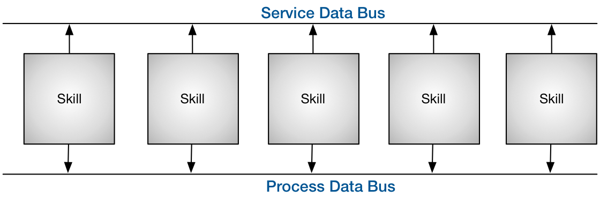

# Die MicroCell Architektur
Dezentrale Steuerungsarchitektur der OurPlant Maschinenplattform

## Einführung

Wozu braucht es eine neue, eine andere Steuerungsarchitektur? Wohl stellt sich die Frage in Hinblick auf die Unmengen an Lösungen der Steuerungstechnik und der Softwarestrukturen. Und dennoch scheint es unter den Gesichtspunkten einer neuen Zeit Schranken in unserem Denken zu geben, die uns einen einfache evolutionäre Weiterentwicklung der bestehenden Basis verwehren.

# Grundlos wird sich nichts verändern

Industrie 4.0 und Digitalisierung. Buzzer-Words der aktuellen Zeit verkünden sie eine Industrierevolution, deren Sinn und Grundgedanken nicht immer ganz offensichtlich sind. 

Erstaunlich genug, dass führende Institute in Studien tiefgreifend untersuchen, ob es gar nur eine Industrie-Evolution sei und weniger einer Revolution. Sind wir doch allerorts in unserer modernen Industrie des 21. Jahrhunderts bereits schon längst digital ausgestattet und gut vernetzt. Und selbst dieser Text, geschrieben auf einen portablen Rechner angedockt an eine Cloud zum öffentlichen Verbreiten dieses Gedankengutes. Etwas Feintuning, einige Notepad in der Fertigung, höhenverstellbare Tische und ein guter Scanner zur Produktverfolgung. Fertig ist Industrie 4.0. Wer es glaubt kennt das eigentliche Motiv hinter der Digitalisierung und hinter Industrie 4.0 offensichtlich noch nicht. Prof. Dr. Piller der RWTH Aachen sagt:

> Die Digitalisierung wird schneller Gewinner produzieren, als die Verlierer merken, dass sie Verlierer sind.

Also sei allen Corsicht geboten, die sich allzu gern auf den Lorbeeren der deutschen Industriegeschichte ausruhen möchten. Oder mit den Worten von Peter Kruse: "Und bist Du nicht willig, dann brauch ich Geduld."

## Digitalisierung und Industrie 4.0

Wer sich mit der Fragestellung Digitalisierung oder Industrie 4.0 (gerne auch Wirtschaft oder Gesellschaft 4.0) der muss sich etwas aus der Mitte der Technik entfernen. Auch hier gilt: Never change a running system. Und so stellt im Gegenzuzug die Frage, warum so radikale Veränderungen, wie Revolution names Industrie 4.0, im Gange sein sollen. Den Grund dafür liefert bereits 2010 Yoram Koren vom MIT in seiner Arbeit über "The global manufacuring revolution". 

Letztendlich sind es die Bedürfnisse oder auch der vermakrtbare Nutzen, der alle Kräfte einer Wirtschaft und Industrie hervorbringt. Wer Bedürfnisse erfüllt, für die andere bereit sind, Geld zu zahlen, macht ein Geschäft. Wer das Bedürfnisse Vieler gleichzeitig erfüllen kann, macht das ganz große Geschäft. So entstand vor mehr als 150 Jahren das Industriezeitalter, den Wirtschaftlern als Taylorismus bekannt. Die Wertschöpfung verändert sich von der handwerklichen Manufaktur hin zur Massenproduktion. Henry Ford wollte jeden in die Lage versetzen, ein Automobil zu fahren. Hauptsache es war schwarz und hieß Ford T.

Seit dieser Zeit hat sich unsere Industrie, Ihre Prozesse und Methoden ständig verbessert. Am Gipfel der Massenproduktion kamen jedoch durch Wohlstand und Marktsättigung mehr und mehr die individuellen Bedürfnisse der Menschen durch. Seither befinden wir uns im Zeitalter des Mass-customzing. Industrialisiert und zu Preisen der Massenproduktion erwarten wir Konsumenten nicht irgend ein Produkt, sondern genau das Produkt unserer Vorstellungen. Natürlich sofort oder spätestens morgen.

Wer "echte" digitale Produkte anbieten will, weiß es längst. DIGITALISIERUNG ist die totale Individualisierung für Jeden. Egal wann, egal wo, egal wieviel, egal wie ausgefallen.

Schon die großen Studien von Gartner, IBM, Forbes & Co. ergaben unlängst: Der Weg zur digitalen Transformation führt über Automatisierung und Individualisierung. Aus Sicht konventioneller analoger Industrialisierung, was für ein Gegensatz.

Die bislang erfolgreichen Automatisierungslösungen inklusive ihrer recht statischen Steuerungsarchitekturen sind einer ausufernden totalen Individualität einfach nicht mehr gewachsen. Sie stammen noch aus der Zeit der Massenproduktion. Ihre zentralen Steuereinheiten sind unflexibel und kaum in der Lage sich rasen schnell anzupassen. Kurz um, sie sind am Ende. Und das ist wirklich Grund genug, für ein Revolution. Die Kämpfer auf den Barrikaden sind keine Krieger, es sind Softwareentwickler und innovative Neudenker. Ihre Waffen sind ihre Rechner, die Munition ist Code. Sie sind die digitale Generation.

## Eine Architektur als Baustein einer neuen dezentralen unabhängigen Steuerungswelt

Diese MicroCell Architektur ist ein möglicher Baustein. Sie ist dezentral und wandelbar. Unabhängig und unvoreingenommen. Generisch und sehr abstrakt. Sie ist ein Bauanleitung für einen digitalen Organismus, ein System, welches wächst durch Code vieler Entwickler.

# Auf dem Weg zur neuen Architektur

## Ziel dieser Architektur Entwicklung

+ Wandlungsfähiges und flexibles Steuerungssystem
+ Dezentral, Anbieter unabhängig, verteilte Ressourcen
+ Modular und modifizierbar, skalierbar
+ Entwickler unabhängig
+ Offen dezentral entwickelt und dennoch hohe Stabilität und Qualität

Die MicroCell Architektur ist eine offene, unabhängige dezentrale Systemarchitektur. Sie ist entwickelt, um unbegrenzt und unabhängig Entwickler für eine gemeinsame Lösung zu vereinen. 

Sie hat den Anspruch ganzheitlich auf die gesamte Herausforderung der Automatisierung zu wirken.

## RAMI 4.0 zeigt in die richtige Richtung

## Die Hierarchie der Automatisierungspyramide

## Ein kurzer Blick auf Systemtheorie und andere Modelle

> Das Ganze ist mehr als die Summe seiner Teile. *(Aristoteles)*

Streift man so durch die Welt der Darstellungsmodelle so fallen eine einige schlüssige Konzepte in Auge. Eines der wohl bekanntesten in der Softwareszene dürfte immer noch das ERM (Entity-Relationchip-Modell) zur Darstellung von Datenmodellen sein.

Lehnen wir uns an diese Form der Abbildung von Beziehung zwischen Systemen kommen wir einem möglichen architektonischen Ansatz schon etwas näher. Stellt sich nur noch die Frage, was als Entität abstarkt und generisch genug ist, um ein ganzheitliches und vollständiges digitales Abbild einer Automatisierungswelt zu liefern.

## Alles eine Frage von Fähigkeiten

Die Suche führt uns zum Begriff der Fähigkeiten (Skill). Ein System kann sich über seine Fähigkeit beschreiben. User eines Systems sind auch einzig von außen gesehen an den Fähigkeiten eines Systems interessiert. Bringe ich Subsysteme mit ihren Fähigkeiten auf die richtige Weise zusammen, entsteht eine neue Fähigkeit die ein übergeordnetes oder benachbartes System nützlich finden könnte. Arbeitsteilung über Fähigkeiten, wie im wahren Leben. Und selbst eine Fähigkeit zu besitzen, ist schon eine Fähigkeit. Einen Integer zu repräsentieren, ist ebenso eine Fähigkeit, wie in einem Kamerabild ein Objekt zu finden, den Hauptschalter abzufragen oder selbst das Gesamtsystem einer Produktionsanlage zu sein. Man ahnt schon, Fähigkeiten wohin das Auge reicht. Egal wie tief man eintaucht, immer kommen neue Fähigkeiten zum Vorschein. Gerade so, wie beim Apfelmännchen.

Physisch angeordnet macht es gar keinen Sinn, diese hierarchisch durch unterschiedliche Kommunikationsarten und Standards zu verbinden. All das würde völlig unnötig einschränken und dem System an anderer Stelle klassisch den Weg abschneiden. 

## Vordefinierte Interface zur Verbindung der Fähigkeiten untereinander

# Lizenz

Dieses Werk ist lizenziert unter einer <a rel="license" href="http://creativecommons.org/licenses/by-sa/4.0/">Creative Commons Namensnennung - Weitergabe unter gleichen Bedingungen 4.0 International Lizenz</a>.